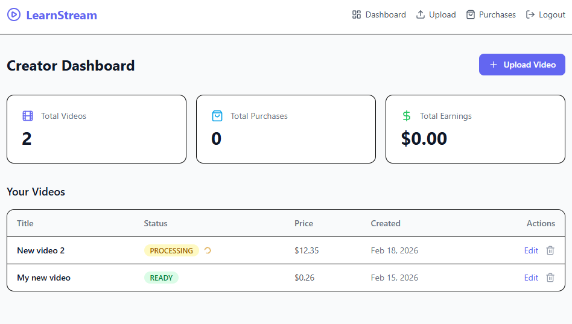
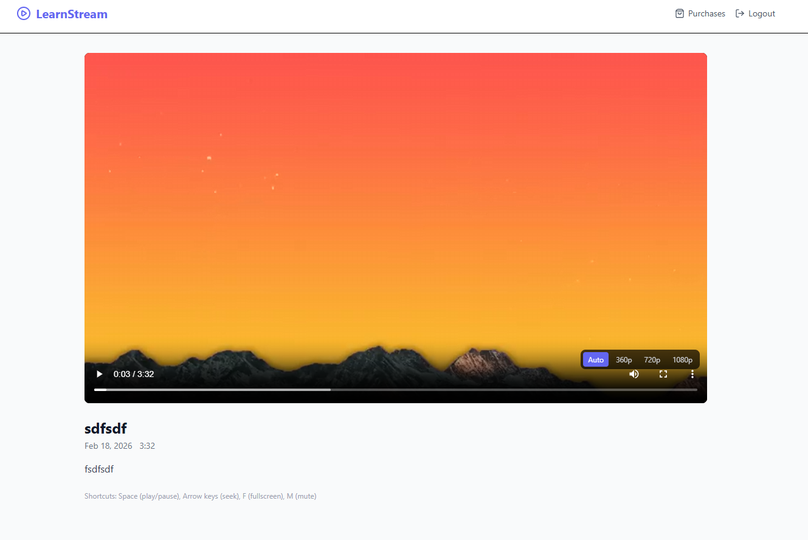
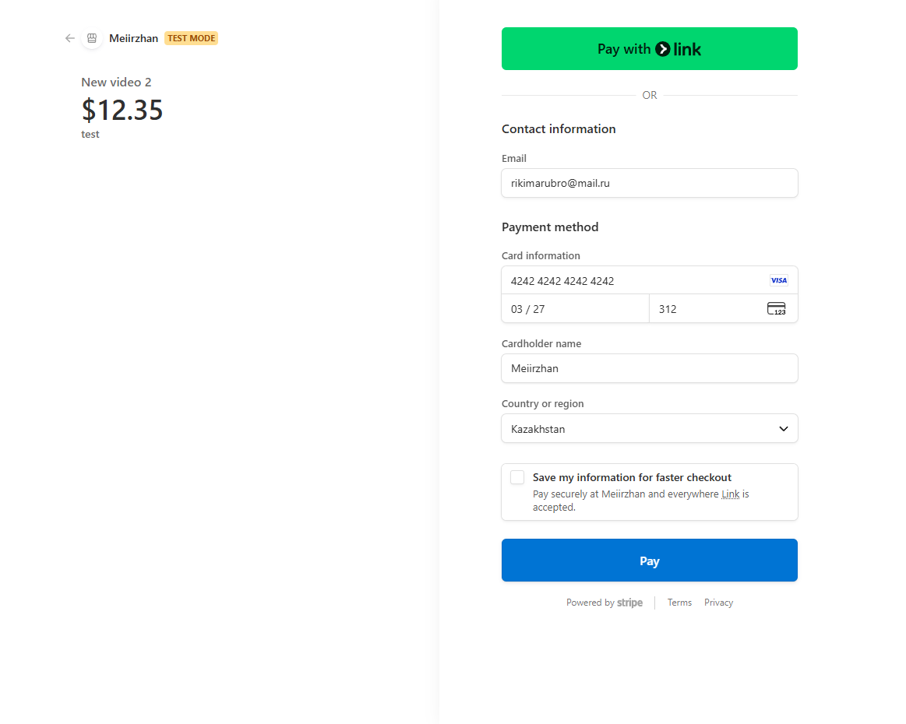
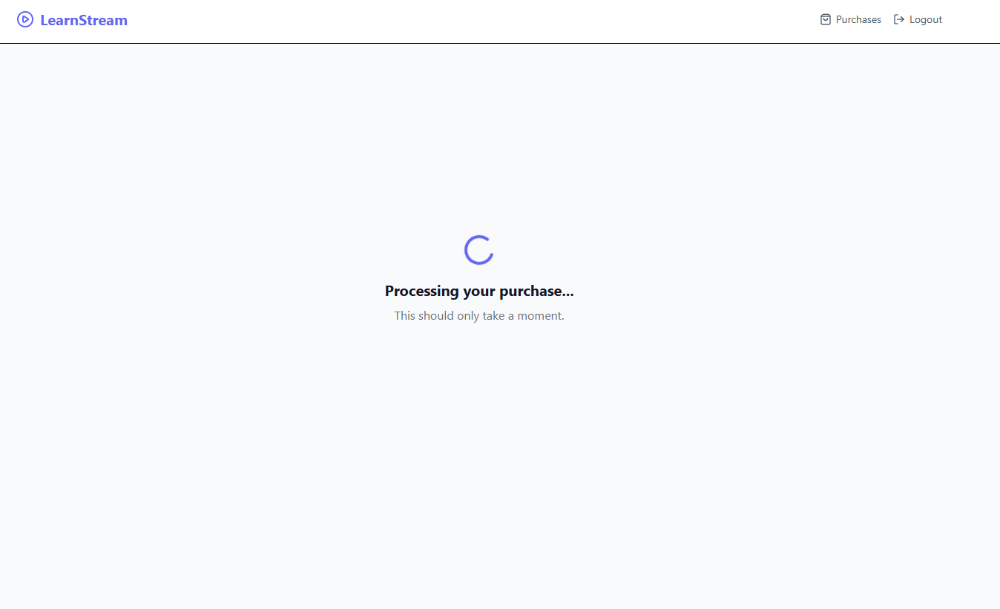
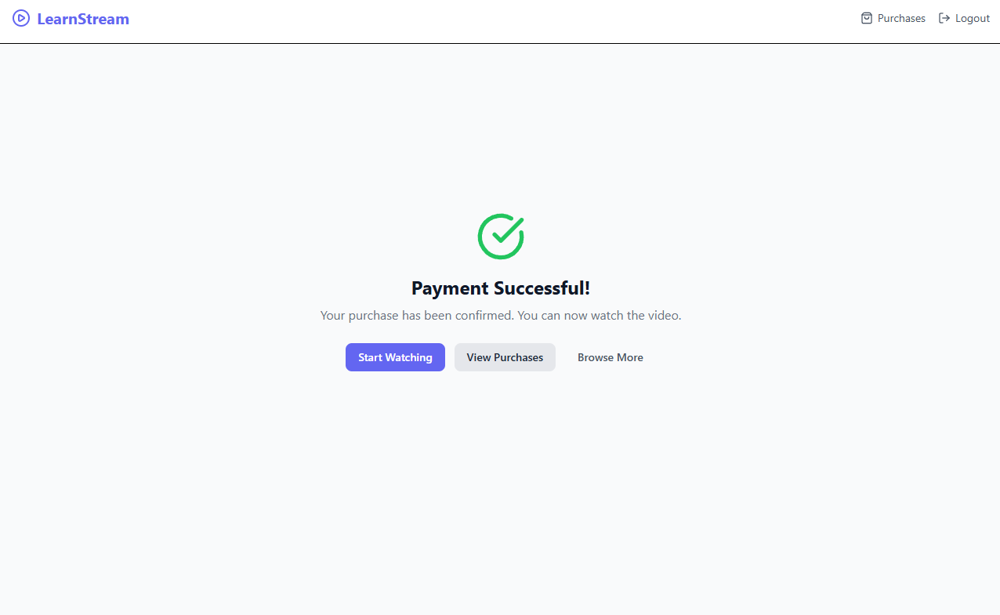
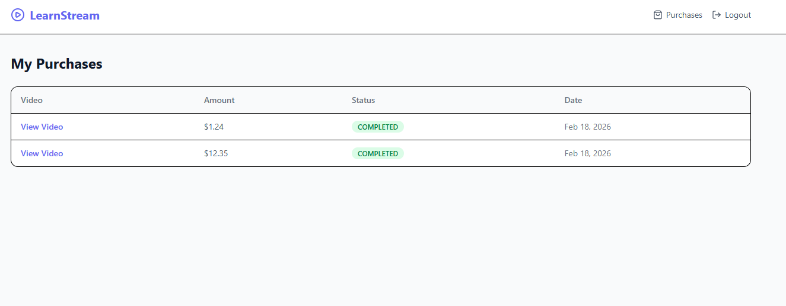

# LearnStream

A full-stack video payment platform built to learn and demonstrate best practices in **payment systems** (Stripe Checkout + webhooks) and **video streaming** (HLS adaptive bitrate via FFmpeg). Creators upload videos, viewers pay to watch, and the platform handles the entire lifecycle: upload, transcoding, secure streaming, and payment fulfillment.

## Purpose

This project exists as a hands-on learning exercise for two complex domains:

1. **Payment Integration** — Stripe Checkout Sessions, webhook-driven fulfillment, idempotent event processing, and handling edge cases (free videos, duplicate purchases, minimum amount validation).

2. **Video Streaming** — Raw video upload to S3-compatible storage, server-side transcoding to multi-quality HLS (360p/720p/1080p), adaptive bitrate playback, and authenticated streaming through a backend proxy (no public bucket access).

## Screenshots

### Creator Dashboard
Creators manage uploaded videos, track processing status, view total purchases and earnings.



### Video Player with Adaptive Quality Selector
HLS.js player with manual quality switching (360p, 720p, 1080p, Auto). All stream segments are authenticated via JWT through a backend proxy.



### Stripe Checkout
Stripe-hosted checkout page in test mode. The backend creates a Checkout Session with video metadata, and Stripe handles the payment form.



### Payment Confirmation
After Stripe redirects back, the app polls the backend to confirm the webhook has completed the purchase.





### Purchase History
Viewers see their completed purchases with amounts and dates.



## Architecture

```
┌──────────────┐     ┌──────────────┐      ┌──────────────┐
│   Frontend   │────>│   Nginx      │─────>│  Spring Boot │
│   React/Vite │     │   Reverse    │      │   Backend    │
│   HLS.js     │     │   Proxy      │      │   (Java 21)  │
└──────────────┘     └──────────────┘      └──────┬───────┘
                                                  │
                          ┌───────────────────────┼──────────────────────┐
                          │                       │                      │
                   ┌──────▼──────┐        ┌───────▼──────┐       ┌───────▼──────┐
                   │  PostgreSQL │        │    MinIO     │       │    Kafka     │
                   │  (Users,    │        │  (S3-compat) │       │  (Transcode  │
                   │   Videos,   │        │  raw-videos  │       │   Jobs)      │
                   │   Purchases)│        │  processed-  │       │              │
                   └─────────────┘        │  videos      │       └──────────────┘
                                          └──────────────┘
                                                                  ┌──────────────┐
                                                                  │   Stripe     │
                                                                  │   (Checkout  │
                                                                  │   + Webhooks)│
                                                                  └──────────────┘
```

## Tech Stack

| Layer | Technology |
|-------|-----------|
| Frontend | React 19, TypeScript, Vite 7, Tailwind CSS 4, Zustand, HLS.js, React Hook Form + Zod |
| Backend | Spring Boot 4.0.2, Java 21, Spring Security, JPA/Hibernate |
| Database | PostgreSQL 17 with Flyway migrations |
| Storage | MinIO (S3-compatible) with AWS SDK v2 |
| Streaming | FFmpeg transcoding to HLS, backend proxy with JWT auth |
| Payments | Stripe Checkout Sessions + webhook fulfillment |
| Messaging | Apache Kafka (transcoding job queue) |
| Infrastructure | Docker Compose, Nginx reverse proxy, multi-stage Docker builds |

## Key Features

- **JWT Authentication** — Access tokens (15 min) + refresh tokens (7 days) with proactive background refresh so tokens never expire during playback
- **Video Upload & Transcoding** — Upload raw video, Kafka-driven async transcoding to 3 HLS quality levels via FFmpeg
- **Secure HLS Streaming** — All stream segments served through an authenticated backend proxy (no public bucket access)
- **Stripe Payments** — Full checkout flow with webhook-based fulfillment, idempotent event processing, free video fast-path
- **Creator Dashboard** — Upload videos, set prices, manage thumbnails, view earnings and purchase stats
- **Adaptive Bitrate Playback** — HLS.js with Auto/360p/720p/1080p quality selector

## Getting Started

### Prerequisites

- Docker and Docker Compose
- Stripe account with test API keys
- Stripe CLI (for local webhook forwarding)

### Setup

1. Clone the repository:
   ```bash
   git clone <repo-url>
   cd Video-Payment-Platform
   ```

2. Create your environment file:
   ```bash
   cp .env.example .env
   ```

3. Fill in the required values in `.env`:
   ```env
   DB_PASSWORD=your_postgres_password
   MINIO_SECRET_KEY=your_minio_secret
   JWT_SECRET=your_base64_encoded_hmac_secret
   STRIPE_SECRET_KEY=sk_test_...
   STRIPE_WEBHOOK_SECRET=whsec_...
   ```

4. Start all services:
   ```bash
   docker compose up -d
   ```

5. Forward Stripe webhooks (in a separate terminal):
   ```bash
   stripe listen --forward-to localhost:8080/api/webhooks/stripe
   ```
   Copy the webhook signing secret from the output and update `STRIPE_WEBHOOK_SECRET` in `.env`, then restart the app:
   ```bash
   docker compose restart app
   ```

6. Open the app at **http://localhost:3000**

### Local Development (without Docker)

For backend/frontend development, run infrastructure in Docker and the apps locally:

```bash
# Start infrastructure only
docker compose up -d postgres minio kafka

# Run backend (separate terminal)
cd StreamApplication
./gradlew bootRun

# Run frontend (separate terminal)
cd client
npm install
npm run dev
```

Frontend dev server runs at `http://localhost:5173`, backend at `http://localhost:8080`.

## Project Structure

```
Video-Payment-Platform/
├── StreamApplication/          # Spring Boot backend
│   ├── src/main/java/com/learnstream/
│   │   ├── auth/               # JWT authentication & registration
│   │   ├── user/               # User entity & repository
│   │   ├── video/              # Video CRUD, upload, HLS proxy
│   │   ├── storage/            # MinIO/S3 storage service
│   │   ├── payment/            # Stripe checkout & webhooks
│   │   ├── transcoding/        # FFmpeg HLS transcoding via Kafka
│   │   └── config/             # Security, CORS, web config
│   └── src/main/resources/
│       ├── application.yml     # Configuration (profiles: local, dev)
│       └── db/migration/       # Flyway SQL migrations (V1-V6)
├── client/                     # React frontend
│   ├── src/
│   │   ├── api/                # Axios API client & endpoints
│   │   ├── auth/               # Auth store (Zustand), login/register pages
│   │   ├── videos/             # Catalog, detail, watch pages, HLS player
│   │   ├── payment/            # Checkout success/cancel pages
│   │   ├── creator/            # Dashboard, upload, edit pages
│   │   └── shared/             # Layout, buttons, pagination components
│   ├── nginx.conf              # Production reverse proxy config
│   └── Dockerfile              # Multi-stage build (Node + Nginx)
├── docker-compose.yml          # Full stack orchestration
├── screenshots/                # App screenshots
└── .env.example                # Environment variable template
```

See the individual READMEs for more details:
- [Backend README](StreamApplication/README.md) — API endpoints, database schema, services
- [Frontend README](client/README.md) — Pages, state management, components

## Learning Topics Covered

### Payment Systems
- Stripe Checkout Session creation with metadata for fulfillment linking
- Webhook signature verification and idempotent event processing via `stripe_events` table
- Handling edge cases: free videos, already-purchased checks, creator self-purchase prevention
- PENDING -> COMPLETED state machine driven by webhook events
- Minimum amount validation per Stripe account region

### Video Streaming
- Raw video storage in S3-compatible object storage (MinIO)
- Multi-quality HLS transcoding with FFmpeg (adaptive bitrate streaming)
- Authenticated HLS proxy — every `.m3u8` manifest and `.ts` segment requires a valid JWT
- HLS.js integration with `xhrSetup` for transparent token injection
- Automatic thumbnail extraction from video frames during transcoding
- Proactive JWT refresh timer to prevent token expiry during long playback sessions

### Authentication
- Stateless JWT with access/refresh token pattern
- Axios interceptor with failed-request queue for transparent token refresh
- Zustand persist middleware for surviving page refreshes
- HLS.js reactive error handler as fallback for expired tokens during streaming
- Singleton refresh promise to deduplicate concurrent refresh calls

## Status

This is a **learning project** — not production software. It demonstrates real-world patterns but is not hardened for production use (e.g., hardcoded redirect URLs, no rate limiting, no email verification).
